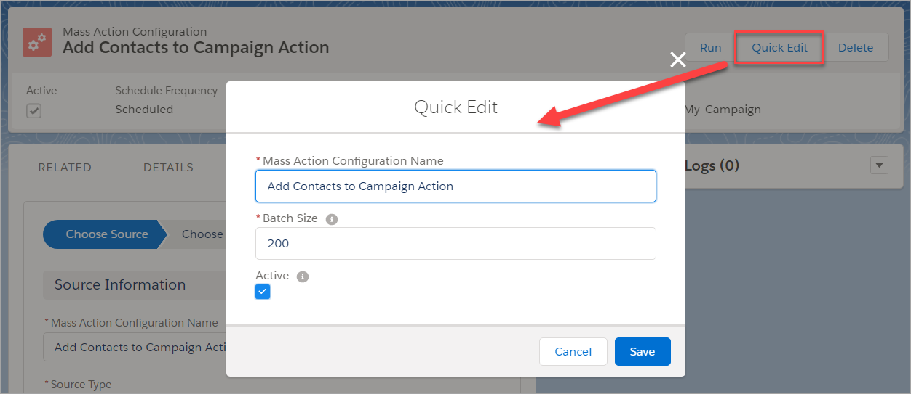
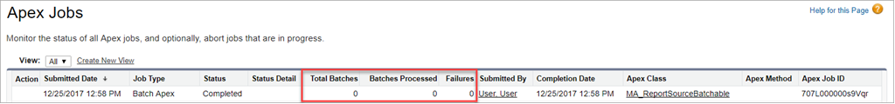

Mass Action Scheduler
=======================

Overview
--------

Declaratively schedule Process Builder, Flows, Quick Actions, Email Alerts, Workflow Rules, and Apex to process records from Reports and List Views.

* **Declarative** - no code necessary, never write batch apex again for queries that can be expressed in a report or list view and actions that can be expressed in a declarative alternative
* **On Platform** - everything happens in Salesforce so no exporting or uploading data
* **Timely** - run actions manually or schedule hourly, daily, weekly, or any time in between

Inspired by Marie Chandra's idea [Ability to Schedule when Process Builder Triggers](https://success.salesforce.com/ideaView?id=08730000000DjEmAAK).

No more waiting for records to be updated or creating clever workarounds to cause records to be updated to cause these actions to fire.

Data Sources
------------

Identify the records you want to process with list views or tabular reports.

| Data Sources      | When to Use |
|-------------------|-------------|
| **List Views**    | Simple filters. For up to [50 million records](https://help.salesforce.com/articleView?id=000176644&type=1). |
| **Reports**       | Complex filters like [Cross Filters](https://help.salesforce.com/articleView?id=reports_cross_filters_create.htm&type=5). For up to [~14 thousand records](https://github.com/DouglasCAyers/sfdc-add-campaign-members-by-report/issues/17#issuecomment-332382142). |

Actions
-------

Almost any process automation you configure can be scheduled.

| Actions               | Supported Types |
|-----------------------|-----------------|
| **Process Builder**   | Processes that start when invoked by another process | 
| **Flows**             | Auto-launched flows (no screens). Any that can be called from Process Builder |
| **Quick Actions**     | Create a Record, Update a Record, and Log a Call types |
| **Email Alerts**      | All |
| **Workflow Rules**    | All |
| **Apex**              | Classes annotated with @InvocableMethod | 

Scheduling
----------

Flexible options for scheduling when a configuration runs.

| Scheduling Options        | When to Use |
|---------------------------|-------------|
| **Manual**                | Run on-demand from UI via button |
| **Automated**             | Run a configuration from Process Builder, Flow, or Apex |
| **Simple Schedule**       | Easily pick the hours, days, and months to run repeatedly |
| **Advanced Schedule**     | Complex scheduling needs that require a cron expression |

What you can do with Mass Action Scheduler
------------------------------------------

I'm sure you will think of all kinds of ideas how you can use this app. Here are a few ideas:
* Run a process monthly, maybe to create a record or callout to an external system
* Run data correction actions daily
* Automatically add leads and contacts to campaigns based on report or list view criteria
* Send emails on a periodic basis
* Create "infinite" flows that continuously loop on a schedule
* Perform field updates without exporting or importing data

For walkthroughs please check out the [examples in the wiki](https://github.com/DouglasCAyers/sfdx-mass-action-scheduler/wiki/Examples).

Pre-Requisites
--------------

There are a few items you need to setup before installing and using this app.

1. You will need to use **Lightning Experience** because we are using Lightning Components.
2. You will need to enable **My Domain** because we are using Lightning Components.
3. You will need to configure a **Named Credential** because the app processes records in background jobs and will need to securely invoke the Salesforce REST API via OAuth when you are not around. 

Please see the [instructions in the wiki](https://github.com/DouglasCAyers/sfdx-mass-action-scheduler/wiki/Pre-Requisites-Instructions) for screen shots and step-by-steps.

Packaged Release History
========================

Release 1.5 (current)
-----------
* Install Package
  * [Production](https://login.salesforce.com/packaging/installPackage.apexp?p0=04tf4000001I187)
  * [Sandbox](https://test.salesforce.com/packaging/installPackage.apexp?p0=04tf4000001I187)
* Enhancement [Capture full error message if batch error trying to invoke target action](https://github.com/DouglasCAyers/sfdx-mass-action-scheduler/issues/8)

Release 1.4
-----------
* Enhancement [Show error message when try to save active configuration with invalid custom cron expression](https://github.com/DouglasCAyers/sfdx-mass-action-scheduler/issues/2) 

Release 1.3
-----------
* Enhancement [Clarify which Workflow Rules run when choosing action type](https://github.com/DouglasCAyers/sfdx-mass-action-scheduler/issues/9)

Release 1.2
-----------
* Initial public release

Installing the Source Code (Developers)
---------------------------------------

This repository is organized using [SalesforceDX](https://trailhead.salesforce.com/en/trails/sfdx_get_started).
You may install the unmanaged code from GitHub and make any desired adjustments.
You are responsible for ensuring unit tests meet your org's validation rules and other requirements.
You can conveniently deploy the source to a new scratch org using [Wade Wegner](https://github.com/wadewegner/deploy-to-sfdx)'s deploy tool:

Getting Started
===============

1. Assign the `Mass Action Admin` permission set to yourself
2. Switch to Lightning Experience. Using this app in Classic is not supported.
3. Create a list view or report that identifies the source records you want to process
4. Create a supported* Process Builder, Flow, Quick Action, Email Alert, Workflow Rule, or Apex class that you want to invoke on the source records
5. Navigate to the `Mass Action Scheduler` app
6. Click the `Mass Action Configurations` tab then click `New` button
7. Fill out the form, clicking `Next` button to advance through the wizard

_*see table of supported action types at top of this document._

Frequently Asked Questions
=========================

What magic enables such awesomeness?!
-------------------------------------

All this is made possible by the [Salesforce Actions API](https://developer.salesforce.com/docs/atlas.en-us.api_rest.meta/api_rest/resources_actions_invocable_custom.htm).

Why is a Named Credential required?
-----------------------------------

Just as when you use Data Loader to export or import records to Salesforce you are prompted to login.
The user you log in with is the "context user" for those operations, granting access to records and defining the "Last Modified By".
Similarly, the Mass Action Scheduler app will log in as a user to run Process Builder, Flow, Quick Actions, etc. operations too.
But because these happen in the background and we do not want to insecurely store usernames and passwords then we instead securely store them as Named Credentials.

What user do the actions run as?
--------------------------------

The context user that the Process Builder, Flow, Quick Actions, Email Alerts, Workflow Rules, and Apex run as is determined by the
**Named Credential** chosen when creating the Mass Action Configuration. Generally, you may want this to be an admin user but you can
certainly create and use Named Credentials that use non-admin credentials.

How do I activate or inactivate a configuration?
----------------------------------------------

On the Mass Action Configuration detail page, click the **Quick Edit** button then check or uncheck the `Active` field then click **Save**.
A Mass Action Configuration that is **inactive** will not run, even if you click the **Run** button to manually kick it off or if you use
automation like Process Builder, Flow, or Apex to call the `MA_RunConfigInvocable` invocable apex class.

How do I change how many records are processed at a time (batch size)?
--------------------------------------------------------------------

On the Mass Action Configuration detail page, click the **Quick Edit** button then set the value for `Batch Size` field to be between 1 and 200 then click **Save**.

What are Mass Action Logs? How do I know if an error occurs?
------------------------------------------------------------

If there is an error when the Mass Action tries to run (e.g. submitting the background apex batch job) then the error will be reported here.
Specific DML errors such as errors due to validation rules, required fields not being assigned, errors in a Flow, or otherwise any errors
that occur within your selected action are **not** reported here because technically the app can't monitor them. Those errors will be reported
however you normally receive such notifications, such as system emails to the administrator.

I recommend that you subscribe to receive [Apex Exception Emails](https://help.salesforce.com/articleView?id=000170712&type=1) as some failures
may prevent the app from ever getting a chance to report the issue via a Mass Action Log record.

You may also [monitor the background batch jobs](https://trailhead.salesforce.com/en/modules/asynchronous_apex/units/async_apex_monitoring) for errors.

Can I edit the Mass Action Configuration record in Classic or outside the Configure tab in Lightning Experience?
----------------------------------------------------------------------------------------------------------------

You shouldn't, no. Although technically you _can_ update the Mass Action Configuration record through various means
in Salesforce (it is just data), any method outside of the **Configure** tab or **Quick Edit** button in Lightning Experience are **not supported**
and may cause undesired results or cause your configuration to become inoperable. This is why I provide the **Configure** wizard =)

How do I run a single or specific Workflow Rule like I can pick a specific Process Builder or Flow?
---------------------------------------------------------------------------------------------------

The Salesforce API does not offer an option to run specific Workflow Rules.
Instead, all Workflow Rules are evaluated and those whose entry criteria are met
are applied to those records. To ensure only a specific Workflow Rule runs then
you will need to adjust the entry criteria.

If I schedule an action that updates the records, do my other Process Builders, Workflow Rules, Apex Triggers, etc. fire like normal?
-------------------------------------------------------------------------------------------------------------------------------------

Yes. If you schedule an action that causes records to be created, updated, or deleted then the same [rules apply](https://developer.salesforce.com/docs/atlas.en-us.apexcode.meta/apexcode/apex_triggers_order_of_execution.htm) just as
if you had created, updated, or deleted the records manually with Data Loader or any other means.

Error: System.HttpResponse[Status=Bad Request, StatusCode=400] ... An error occurred when trying to start a flow
----------------------------------------------------------------------------------------------------------------

Ensure the user represented by the Named Credential used by the Mass Action Configuration has **Force.com Flow User** checked on their user record.

Please check that the `Connected App`, `Auth. Provider`, and `Named Credential` are configured correctly per the [instructions in the wiki](https://github.com/DouglasCAyers/sfdx-mass-action-scheduler/wiki/Pre-Requisites-Instructions).

Please check if the admin who last activated the process or flow received an [error email](https://developer.salesforce.com/docs/atlas.en-us.salesforce_vpm_guide.meta/salesforce_vpm_guide/vpm_troubleshoot_email.htm) which may include more details to help troubleshoot.

Error: System.HttpResponse[Status=Moved Permanently, StatusCode=301] ... An error occurred when trying to start a flow
----------------------------------------------------------------------------------------------------------------------

Usually means there is a problem with the chosen `Named Credential` authenticating to Salesforce. Please check that the `Connected App`, `Auth. Provider`, and `Named Credential` are configured correctly per the [instructions in the wiki](https://github.com/DouglasCAyers/sfdx-mass-action-scheduler/wiki/Pre-Requisites-Instructions).

Nothing seems to happen when my Mass Action Configuration runs and the Apex Jobs page lists 0 for Total Batches, Batches Processed, and Failures.
-------------------------------------------------------------------------------------------------------------------------------------------------

Ensure the user represented by the Named Credential used by the Mass Action Configuration has access to the list view or report being used.

My question isn't answered here, how can I contact you about my question or feature request?
--------------------------------------------------------------------------------------------

Please review the [project issue tracker](https://github.com/DouglasCAyers/sfdx-mass-action-scheduler/issues?utf8=%E2%9C%93&q=is%3Aissue) as your question may have already been asked/answered there and just hasn't made it to the FAQ yet.
If you don't find what you're looking for please ask your question or request a feature by opening a new [issue](https://github.com/DouglasCAyers/sfdx-mass-action-scheduler/issues). Thank you!

Credits
=======

[Doug Ayers](https://douglascayers.com) develops and maintains the project.

[Appiphony](http://www.lightningstrike.io) for developing the Strike Wizard component.

[Salesforce Foundation](https://github.com/SalesforceFoundation/CampaignTools) for developing tools for querying Salesforce Reports API.

License
=======

The source code is licensed under the [BSD 3-Clause License](LICENSE)
