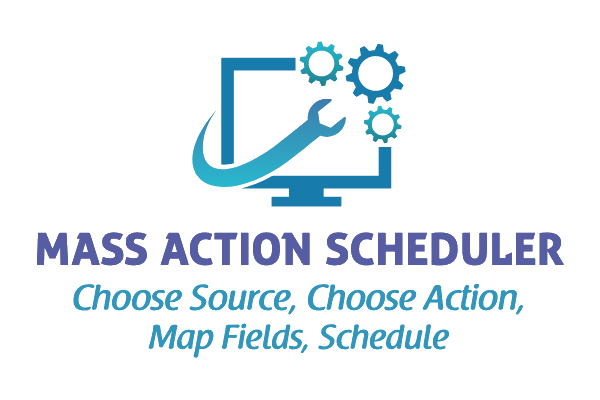

<!-- SHIELDS -->
[![Latest Version][version-shield]][version-url]
[![Salesforce Community Support][community-shield]][community-url]
[![Sponsor][sponsor-shield]][sponsor-url]
[![License][license-shield]][license-url]

<!-- PROJECT LOGO -->

  
   
  Declaratively schedule process automation from reports and list views!
   
  <a href="https://github.com/douglascayers-org/sfdx-mass-action-scheduler/wiki"><strong>Explore the docs »</strong></a>
   
   
  <a href="https://github.com/douglascayers-org/sfdx-mass-action-scheduler/wiki/Examples">View Examples</a>
  ·
  <a href="https://github.com/douglascayers-org/sfdx-mass-action-scheduler/issues">Report Bug</a>
  ·
  <a href="https://github.com/douglascayers-org/sfdx-mass-action-scheduler/issues">Request Feature</a>

## 📝 Table of Contents

* [About the Project](#-about-the-project)
* [Features](#-features)
* [Roadmap](#-roadmap)
* [Documentation and Discussion](#-documentation-and--discussion)
* [Getting Started](#-getting-started)
  - [Prerequisites](#-prerequisites)
  - [Install Package](#-install-package)
* [Sponsoring](#-sponsoring)
* [Contributing](#-contributing)
* [Authors](#️-authors)
* [Acknowledgements](#-acknowledgements)
* [License](#-license)

 

## 🧐 About the Project

Mass Action Scheduler is a [free-as-in-speech](https://www.howtogeek.com/howto/31717/what-do-the-phrases-free-speech-vs.-free-beer-really-mean/) and [open source](https://opensource.com/resources/what-open-source) developed passion project of [Doug Ayers](https://douglascayers.com).

This project's mission is to put the power of [Batch Apex](https://developer.salesforce.com/docs/atlas.en-us.apexcode.meta/apexcode/apex_batch.htm) within reach of [declarative configuration](https://help.salesforce.com/articleView?id=extend_click_intro.htm&type=5).

🚀 Declaratively schedule Process Builder, Flows, Quick Actions, Email Alerts, Workflow Rules, or Apex to process records from Reports, List Views, SOQL, or Apex.

⏳ No more waiting for records to be updated or creating clever workarounds to cause records to be updated to cause these actions to fire.

### IdeaExchange

💡 This project is inspired by the following IdeaExchange ideas. Please vote them up to increase chances this functionality becomes standard on the Salesforce platform. Thank you!

Inspired by Marie Chandra's idea [Ability to Schedule when Process Builder Triggers](https://success.salesforce.com/ideaView?id=08730000000DjEmAAK).

Inspired by Narender Singh's idea [Ability to schedule flows, workflows and processes in process builder](https://success.salesforce.com/ideaView?id=0873A000000EA71QAG).

 

## 🎈 Features

🙌 **Declarative** - no code necessary, never write Batch Apex again for queries that can be expressed in a report or list view and actions that can be expressed with a declarative alternative.

☁️ **On Platform** - everything happens in Salesforce so no exporting or uploading data necessary.

⏰ **Timely** - run actions manually or schedule hourly, daily, weekly, or any time in between.

🦄 **Versatile** - explore the many [data sources](https://github.com/douglascayers-org/sfdx-mass-action-scheduler/wiki/Sources) and [actions](https://github.com/douglascayers-org/sfdx-mass-action-scheduler/wiki/Actions) that can be [scheduled](https://github.com/douglascayers-org/sfdx-mass-action-scheduler/wiki/Scheduling) with Mass Action Scheduler.

 

## 🗺 Roadmap

See the [open issues](https://github.com/douglascayers-org/sfdx-mass-action-scheduler/issues) for a list of proposed features (and known issues).

 

## 📘 Documentation and 💬 Discussion

* For discussion and feedback [post in the community group](https://success.salesforce.com/_ui/core/chatter/groups/GroupProfilePage?g=0F93A000000LhvN) or raise well defined issues and ideas via the [issue tracker](https://github.com/douglascayers/sfdx-mass-action-scheduler/issues).
* Read the [wiki page](https://github.com/douglascayers-org/sfdx-mass-action-scheduler/wiki) for further documentation on Mass Action Scheduler.
* Read the [FAQ page](https://github.com/douglascayers-org/sfdx-mass-action-scheduler/wiki/Frequently-Asked-Questions) to help troubleshoot technical issues.

 

## 👋 Getting Started

### 🚨 Prerequisites

There are a few items you need to setup before installing and using this app.

1. You will need to [Enable Lightning Experience](https://github.com/douglascayers-org/sfdx-mass-action-scheduler/wiki/Prerequisites#1-enable-lightning-experience) because we are using Lightning Components.
2. You will need to [Enable My Domain](https://github.com/douglascayers-org/sfdx-mass-action-scheduler/wiki/Prerequisites#2-enable-my-domain) because we are using Lightning Components.
3. You will need to [Allow IFraming of Visualforce Pages with Clickjack Protection](https://github.com/douglascayers-org/sfdx-mass-action-scheduler/wiki/Prerequisites#3-allow-iframing-of-visualforce-pages-with-clickjack-protection) because we iframe pages in Lightning Components.

Please see the [instructions in the wiki](https://github.com/douglascayers-org/sfdx-mass-action-scheduler/wiki/Prerequisites) for screen shots and step-by-steps.

### 📦 Install Package

> _Due to Lightning Experience web page caching, please log out and log back in after installing the package for UI changes to appear. Also, don't worry about the [warning about installing a "Non-Salesforce Application"](https://github.com/douglascayers-org/sfdx-mass-action-scheduler/wiki/Frequently-Asked-Questions#why-do-i-see-a-warning-about-installing-a-non-salesforce-application) shown on the package install page._

* Install Managed Package (release v2.2)
    * Browser Links ([Production](https://login.salesforce.com/packaging/installPackage.apexp?p0=04tf4000004MdAC)) ([Sandbox](https://test.salesforce.com/packaging/installPackage.apexp?p0=04tf4000004MdAC))
    * Salesforce CLI (`sfdx force:package:install --package 04tf4000004MdAC --wait 10`)
* Assign the **Mass Action Admin** permission set to users who will configure mass actions.
* [Release Notes](https://github.com/douglascayers-org/sfdx-mass-action-scheduler/wiki/Release-Notes) « includes important upgrade instructions, too

 

## 💎 Sponsoring

Mass Action Scheduler is a [free-as-in-speech](https://www.howtogeek.com/howto/31717/what-do-the-phrases-free-speech-vs.-free-beer-really-mean/) and [open source](https://opensource.com/resources/what-open-source) developed passion project of [Doug Ayers](https://douglascayers.com).

If you've found value in my open source projects, please consider showing your support:
  * ⭐️ [Star](https://github.com/douglascayers-org/sfdx-mass-action-scheduler) this project on GitHub
  * 📣 [Tweet](https://twitter.com/intent/tweet/?url=https%3A%2F%2Fgithub.com%2Fdouglascayers-org%2Fsfdx-mass-action-scheduler&text=%F0%9F%9A%80%20Declaratively%20schedule%20Process%20Builder%2C%20Flows%2C%20Quick%20Actions%2C%20Email%20Alerts%2C%20Workflow%20Rules%2C%20or%20Apex%20to%20process%20records%20from%20Reports%2C%20List%20Views%2C%20SOQL%2C%20or%20Apex%20with%20%23MassActionScheduler%20by%20%40DouglasCAyers&related=douglascayers%2Csalesforcedevs&hashtags=salesforce) this project to your followers
  * Contribute a ☕️ or 🌮 via my [virtual tip jar on PayPal](https://www.paypal.me/douglascayers/)

Thank you! ❤️

https://douglascayers.com/thanks-for-your-support/

 

## 🙏 Contributing

Contributions are what make the open source community such an amazing place to learn, inspire, and create. Any contributions you make are **greatly appreciated**.

Please see the [guidelines for contributing](CONTRIBUTING.md) for more details.

For documentation contributions (the [wiki](https://github.com/douglascayers-org/sfdx-mass-action-scheduler/wiki)), please [open an issue](https://github.com/douglascayers-org/sfdx-mass-action-scheduler/issues) with your suggested changes.

For code contributions, please follow the [GitHub flow](https://help.github.com/en/articles/github-flow):
1. Fork this project.
2. Create your feature branch (`git checkout -b feature/AmazingFeature`).
3. Commit your changes (`git commit -m 'Add some AmazingFeature'`).
4. Push to your feature branch (`git push origin feature/AmazingFeature`).
5. Open a pull request.

 

## ✍️ Authors

* [Doug Ayers](https://douglascayers.com) develops and maintains the project.

See also the list of [contributors](https://github.com/douglascayers-org/sfdx-mass-action-scheduler/contributors) who participated in this project.

 

## 🎉 Acknowledgements

* [Appiphony](http://www.lightningstrike.io) for developing the Strike Wizard component based on Lightning Design System [Path blueprint](https://www.lightningdesignsystem.com/components/path/).
* [Salesforce Foundation](https://github.com/SalesforceFoundation/CampaignTools) for developing tools for querying Salesforce Reports API in Apex.
* [Shinichi Tomita](https://twitter.com/stomita) for developing [jsforce](https://jsforce.github.io/) and [soql-parse](https://github.com/stomita/soql-parse) libraries for easy use of Salesforce REST APIs in JavaScript.
* [jQuery](https://jquery.com/) for developing jQuery library.
* [Aaron Hardy](https://twitter.com/aaronius) for developing [Penpal](https://github.com/Aaronius/penpal), a promise-based library for securely communicating with iframes via postMessage.

 

## 👀 License

The source code is licensed under the [BSD 3-Clause License](LICENSE).

<!-- MARKDOWN LINKS & IMAGES -->

[version-shield]: https://img.shields.io/github/tag/douglascayers-org/sfdx-mass-action-scheduler.svg?label=release&color=green
[version-url]: https://github.com/douglascayers-org/sfdx-mass-action-scheduler/wiki/Release-Notes

[license-shield]: https://img.shields.io/github/license/douglascayers-org/sfdx-mass-action-scheduler.svg?label=license&color=green
[license-url]: LICENSE

[community-shield]: https://img.shields.io/badge/-Join_our_Community-blue.svg?logo=salesforce&logoColor=white
[community-url]: https://success.salesforce.com/_ui/core/chatter/groups/GroupProfilePage?g=0F93A000000LhvN

<!-- https://stackoverflow.com/questions/42679712/why-does-the-red-heart-emoji-require-two-code-points-but-the-other-colored-hear -->
[sponsor-shield]: https://img.shields.io/badge/-💜_Sponsor_this_project-ff69b4.svg
[sponsor-url]: https://github.com/douglascayers-org/sfdx-mass-action-scheduler/blob/master/README.md#-sponsoring
