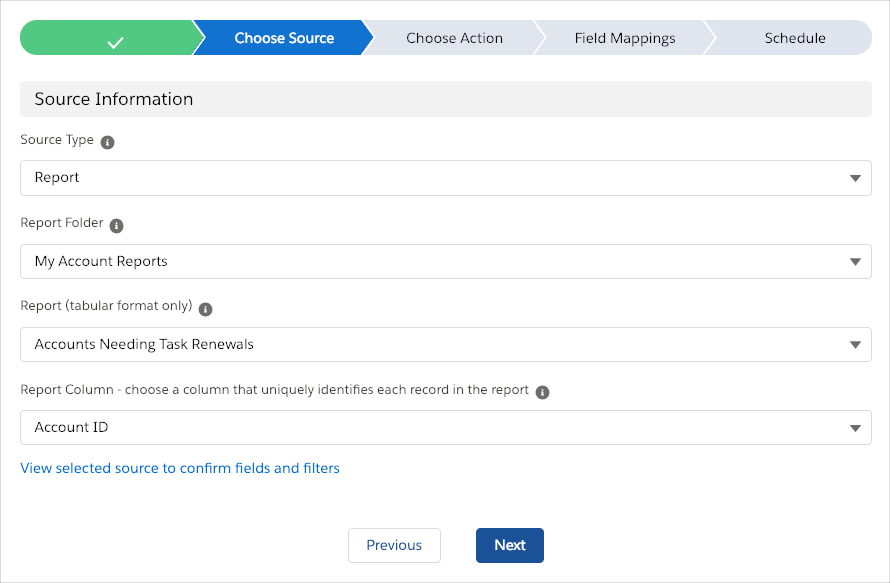
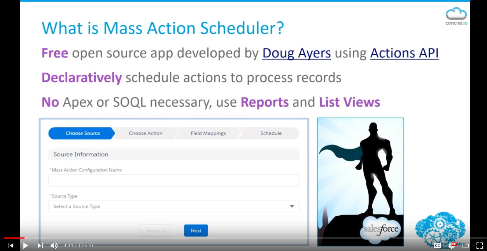

Mass Action Scheduler
=======================

Overview
--------

Declaratively schedule Process Builder, Flows, Quick Actions, Email Alerts, Workflow Rules, and Apex to process records from Reports and List Views.

* **Declarative** - no code necessary, never write batch apex again for queries that can be expressed in a report or list view and actions that can be expressed in a declarative alternative
* **On Platform** - everything happens in Salesforce so no exporting or uploading data
* **Timely** - run actions manually or schedule hourly, daily, weekly, or any time in between

Inspired by Marie Chandra's idea [Ability to Schedule when Process Builder Triggers](https://success.salesforce.com/ideaView?id=08730000000DjEmAAK).

No more waiting for records to be updated or creating clever workarounds to cause records to be updated to cause these actions to fire.

Documentation and Discussion
--------------------------

* For discussion and feedback [post in the community group](https://success.salesforce.com/_ui/core/chatter/groups/GroupProfilePage?g=0F93A000000LhvN) or raise well defined issues and ideas via the [Issues feature](https://github.com/douglascayers/sfdx-mass-action-scheduler/issues).
* Watch my [Automation Hour webinar](http://bit.ly/DAyers010518) introducing the tool and demos.
* Read the [wiki page](https://github.com/douglascayers/sfdx-mass-action-scheduler/wiki) for further documentation on Mass Action Scheduler.
* Read the [FAQ page](https://github.com/douglascayers/sfdx-mass-action-scheduler/wiki/Frequently-Asked-Questions) to help troubleshoot technical issues.

Data Sources
------------

Identify the records you want to process with list views or tabular reports.

| Data Sources      | When to Use |
|-------------------|-------------|
| **List Views**    | Simple filters. For up to [50 million records](https://help.salesforce.com/articleView?id=000176644&type=1). |
| **Reports**       | Complex filters like [Cross Filters](https://help.salesforce.com/articleView?id=reports_cross_filters_create.htm&type=5). For up to [~14 thousand records](https://github.com/douglascayers/sfdc-add-campaign-members-by-report/issues/17#issuecomment-332382142). |

Actions
-------

Almost any process automation you configure can be scheduled.

| Actions               | Supported Types |
|-----------------------|-----------------|
| **Process Builder**   | Processes that start when invoked by another process | 
| **Flows**             | Auto-launched flows (no screens). Any that can be called from Process Builder |
| **Quick Actions**     | Create a Record, Update a Record, and Log a Call types |
| **Email Alerts**      | All |
| **Workflow Rules**    | Active rules |
| **Apex**              | Classes annotated with @InvocableMethod | 

Scheduling
----------

Flexible options for scheduling when a configuration runs.

| Scheduling Options        | When to Use |
|---------------------------|-------------|
| **Manual**                | Run on-demand from UI via button |
| **Automated**             | Run a configuration from Process Builder, Flow, or Apex |
| **Simple Schedule**       | Easily pick the hours, days, and months to run repeatedly |
| **Advanced Schedule**     | Complex scheduling needs that require a cron expression |

What you can do with Mass Action Scheduler
------------------------------------------

I'm sure you will think of all kinds of ideas how you can use this app. Here are a few ideas:
* Run a process monthly, maybe to create a record or callout to an external system
* Run data correction actions daily
* Automatically add leads and contacts to campaigns based on report or list view criteria
* Send emails on a periodic basis
* Create "infinite" flows that continuously loop on a schedule
* Perform field updates without exporting or importing data

For walkthroughs please check out the [examples in the wiki](https://github.com/douglascayers/sfdx-mass-action-scheduler/wiki/Examples).

Pre-Requisites
--------------

There are a few items you need to setup before installing and using this app.

1. You will need to use **Lightning Experience** because we are using Lightning Components.
2. You will need to enable **My Domain** because we are using Lightning Components.
3. You will need to configure a **Named Credential** because the app processes records in background jobs and will need to securely invoke the Salesforce REST API via OAuth when you are not around. 

Please see the [instructions in the wiki](https://github.com/douglascayers/sfdx-mass-action-scheduler/wiki/Pre-Requisites-Instructions) for screen shots and step-by-steps.

Packaged Release History
========================

Release 1.6
-----------

**Upgrade Note**
> I apologize for the inconvenience, but if you have any Mass Action Configuration records that are **active** and whose Schedule Frequency is either **Scheduled** or **Custom**,
then you must temporarily **deactivate** them in order to upgrade to the 1.6 release. Consider [mass editing them via a list view](https://youtu.be/aqgoskD8jbQ),
or use a data loader, to set the `Mass_Action_Configuration__c.Active__c` field to `false`, install the 1.6 release,
then re-activate the records by setting the `Mass_Action_Configuration__c.Active__c` field to `true`.
>
> The technical reason for this inconvenience is [apex code referenced by scheduled jobs is not updateable](https://help.salesforce.com/articleView?id=000004423&language=en_US&type=1).
The 1.6 release introduces a [workaround](https://salesforce.stackexchange.com/questions/24446/how-to-deploy-apex-classes-that-are-scheduled) to avoid this issue for future releases.
>
> If you do not heed this upgrade note, then you may receive the error `This schedulable class has jobs pending or in progress` when trying to install the package
and be prevented from upgrading.

* Install Package ([Production](https://login.salesforce.com/packaging/installPackage.apexp?p0=xxx)) ([Sandbox](https://test.salesforce.com/packaging/installPackage.apexp?p0=xxx))
* Enhancement [Automatic configuration of Connected App, Auth. Provider, and Named Credential with new setup page](https://github.com/douglascayers/sfdx-mass-action-scheduler/issues/26) ([video](https://youtu.be/CCTF7YMbbWo))
* Enhancement [Add Description field because it's always nice to know why your configuration exists](https://github.com/douglascayers/sfdx-mass-action-scheduler/issues/20)
* Enhancement [Add Unique Name field and easier to chain multiple configurations](https://github.com/douglascayers/sfdx-mass-action-scheduler/issues/12)
* Enhancement [Add "Day of Month" to Schedule so can select specific days to run configuration](https://github.com/douglascayers/sfdx-mass-action-scheduler/issues/13)
* Enhancement [Hide "Mass Action Test Named Credential" from Named Credentials options, it is only for internal testing](https://github.com/douglascayers/sfdx-mass-action-scheduler/issues/31)
* Fixed [Selected Quick Action is not being re-selected in configuration wizard](https://github.com/douglascayers/sfdx-mass-action-scheduler/issues/32)
* Fixed [Required to assign non-required field mappings](https://github.com/douglascayers/sfdx-mass-action-scheduler/issues/11)

**NEW: Mass Action Configuration Unique Names**

When installing the managed package, a post install Apex class is ran to automatically populate the new
`Mass_Action_Configuration__c.DeveloperName__c` field with a unique value based on the record's name
by replacing whitespace with an underscore (e.g. "My Config" becomes "My_Config"). If two or more records
would cause duplicate unique names, then the code appends a random four letter suffix to make the developer name unique
(e.g. "My_Config_AYNE"). If there is any error trying to update the records, then the post install script will not
populate the new developer name field for the records that error and you will be prompted to specify your own unique name
the next time you save the record on the Configuration page.

---

Release 1.5
-----------
* Install Package ([Production](https://login.salesforce.com/packaging/installPackage.apexp?p0=04tf4000001I187)) ([Sandbox](https://test.salesforce.com/packaging/installPackage.apexp?p0=04tf4000001I187))
* Enhancement [Capture full error message if batch error trying to invoke target action](https://github.com/douglascayers/sfdx-mass-action-scheduler/issues/8)

---

Release 1.4
-----------
* Enhancement [Show error message when try to save active configuration with invalid custom cron expression](https://github.com/douglascayers/sfdx-mass-action-scheduler/issues/2) 

---

Release 1.3
-----------
* Enhancement [Clarify which Workflow Rules run when choosing action type](https://github.com/douglascayers/sfdx-mass-action-scheduler/issues/9)

---

Release 1.2
-----------
* Initial public release

---

Installing the Source Code (Developers)
---------------------------------------

This repository is organized using [SalesforceDX](https://trailhead.salesforce.com/en/trails/sfdx_get_started).
You may install the unmanaged code from GitHub and make any desired adjustments.
You are responsible for ensuring unit tests meet your org's validation rules and other requirements.
You can conveniently deploy the source to a new scratch org using [Wade Wegner](https://github.com/wadewegner/deploy-to-sfdx)'s deploy tool:

Credits
=======

[Doug Ayers](https://douglascayers.com) develops and maintains the project.

[Appiphony](http://www.lightningstrike.io) for developing the Strike Wizard component.

[Salesforce Foundation](https://github.com/SalesforceFoundation/CampaignTools) for developing tools for querying Salesforce Reports API.

[Shinichi Tomita](https://jsforce.github.io/) for developing jsforce library for easy use of Salesforce APIs.

[jQuery](https://jquery.com/) for developing jQuery library.

License
=======

The source code is licensed under the [BSD 3-Clause License](LICENSE)
